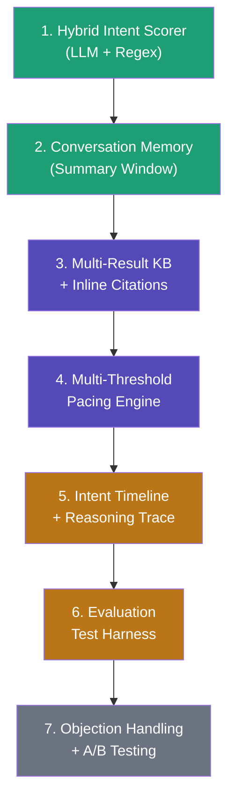

# 🚀 Feature Suggestions — Agentic Sales Consultant

## Current State Assessment

After auditing the entire codebase, here's what you **already have**:

| Component | Status | File |
|-----------|--------|------|
| Intent scoring (regex-based) | ✅ Built | [intent.py](file:///e:/agent%20sales%20guy/backend/services/intent.py) |
| Persona detection (LLM) | ✅ Built | [persona.py](file:///e:/agent%20sales%20guy/backend/services/persona.py) |
| KB retrieval (ChromaDB + embeddings) | ✅ Built | [kb_retrieval.py](file:///e:/agent%20sales%20guy/backend/services/kb_retrieval.py) |
| Calendly suppression gate | ✅ Built | [integrations.py](file:///e:/agent%20sales%20guy/backend/services/integrations.py) |
| Frappe CRM + GitHub auto-filing | ✅ Built | [integrations.py](file:///e:/agent%20sales%20guy/backend/services/integrations.py) |
| Multi-tenant org/slug routing | ✅ Built | [chat.py](file:///e:/agent%20sales%20guy/backend/routes/chat.py) |
| Mobile admin/rep dashboards | ✅ Built | Expo React Native app |
| Embeddable chat widget | ✅ Built | [eduflow-demo.html](file:///e:/agent%20sales%20guy/eduflow-demo.html) |
| Basic analytics (totals, averages) | ✅ Built | [analytics.py](file:///e:/agent%20sales%20guy/backend/routes/analytics.py) |

## Critical Gaps vs. Constraints

> [!WARNING]
> These are areas where your current code **does not yet satisfy** the constraints you listed.

| Constraint | Gap |
|------------|-----|
| **Intent Ambiguity** — "reasoning beyond simple keyword triggers" | `intent.py` is **100% regex** — no LLM-based reasoning for ambiguous signals |
| **Adaptive Pacing** — "suppressing premature scheduling" | Calendly fires on a **hard threshold (76)** — no contextual pacing based on conversation flow |
| **Context Retention** — "remembering earlier signals" | LLM only sees last **6 turns** — earlier signals are lost for long conversations |
| **Citation Accuracy** — "every recommendation must include traceable citation" | KB returns **1 result only**, no multi-source citation or citation verification |
| **Evaluation Safeguards** — "ambiguous transcripts to test inference depth" | **No test harness** exists to evaluate the agent with ambiguous inputs |
| **Intent Confidence Modeling** — "dynamic intent score progression" | Score only goes **up on keywords** and down on filler — no decay, no momentum analysis |

---

## 🏗️ Tier 1 — LLM-Powered Intent Inference (HIGH IMPACT, fills the biggest gap)

> This is the single most innovative change. It replaces keyword matching with genuine semantic reasoning.

### Feature 1.1: Hybrid Intent Scorer (LLM + Regex Ensemble)

**What:** Add a second-pass LLM intent analysis that interprets *meaning*, not just keywords. The regex pass runs first (fast, cheap), then the LLM runs a structured output call to detect **implicit** intent signals that regex misses.

**Example:** _"We've been looking at a few tools, our team of 40 needs something by next quarter"_ — Regex catches `team size`, `timeline`, but misses that "a few tools" implies active evaluation (Comparing), not exploring.

**Constraint it satisfies:** ✅ Intent Ambiguity, ✅ Reasoning beyond keyword triggers

```python
# Proposed: services/intent_llm.py
async def llm_intent_analysis(message: str, conversation_context: list[dict]) -> dict:
    """
    Returns structured output:
    {
        "implicit_signals": ["active_evaluation", "urgency_implied"],
        "confidence": 0.82,
        "reasoning": "Buyer mentions looking at 'a few tools' + team size + deadline → Comparing",
        "suggested_state": "Comparing",
        "score_delta": +30
    }
    """
```

### Feature 1.2: Intent Decay & Momentum

**What:** Intent scores should **decay** over time if the buyer goes silent or sends low-signal messages, and should have **momentum** — 3 consecutive high-signal messages should boost faster than 3 scattered ones.

**Constraint it satisfies:** ✅ Intent Confidence Modeling, ✅ Adaptive Pacing

```
Score decay: -2 points per "filler" message (ok, got it, thanks)
Momentum bonus: If 3 consecutive messages each have delta > 10, apply 1.5x multiplier
Time decay: If >10 min gap between messages, apply 0.9x to accumulated score
```

### Feature 1.3: Signal Contradiction Detection

**What:** Detect when a buyer sends **mixed signals** (e.g., asks about pricing but then says "just exploring"). Instead of blindly summing deltas, the agent should flag the contradiction and ask a disambiguating question.

**Constraint it satisfies:** ✅ Intent Ambiguity, ✅ Adaptive Pacing

---

## 🧠 Tier 2 — Multi-Turn Reasoning Memory (CRITICAL for long conversations)

### Feature 2.1: Conversation Summary Window

**What:** Instead of sending only the last 6 raw turns to the LLM, generate a running **compressed summary** of the entire conversation that gets updated every 4 turns. This summary captures all stated needs, objections, team size, timeline, etc.

**Constraint it satisfies:** ✅ Context Retention

```python
# Proposed: services/memory.py
class ConversationMemory:
    """
    Maintains a rolling summary + key facts extracted from the full conversation.
    Sent to LLM as structured context instead of raw message history.
    """
    summary: str          # "Buyer is a mid-market SaaS team of 40, comparing 3 tools..."
    key_facts: dict       # {"team_size": 40, "timeline": "Q2", "budget_mentioned": True}
    objections: list[str] # ["concerned about migration complexity"]
    unresolved_questions: list[str]  # ["How does SSO work?"]
```

### Feature 2.2: Fact Extraction & Entity Tracking

**What:** Automatically extract structured facts from each message — company name, team size, industry, budget range, competitor mentions, timeline. Store as a JSON object on the lead record.

**Constraint it satisfies:** ✅ Context Retention, ✅ Structured Lead Log

### Feature 2.3: Conversation Stage Regression Detection

**What:** If a buyer who was previously at `Decision-Ready` suddenly asks basic exploratory questions, the system should detect this as a **regression** (maybe a new stakeholder joined) and adjust behavior accordingly rather than continuing to push.

**Constraint it satisfies:** ✅ Adaptive Pacing, ✅ Intent Ambiguity

---

## 📚 Tier 3 — Advanced KB Retrieval & Citation (REQUIRED by constraints)

### Feature 3.1: Multi-Result KB Retrieval with Re-Ranking

**What:** Return **top 3 results** from ChromaDB, then use the LLM to re-rank based on the **full conversation context**, not just the current message.

**Constraint it satisfies:** ✅ Citation Accuracy, ✅ Controlled Knowledge Retrieval

### Feature 3.2: Citation Inline Threading

**What:** Instead of showing a separate resource card, weave citations **directly into the AI reply** with bracketed references:

```
"Our Starter plan at $99/month includes full API access [1]. For teams your size, 
the Pro tier at $299/month adds priority support [1] and Salesforce integration [2]."

[1] SalesGen pricing — sample_kb_data.csv (94% match)
[2] Supported Integrations — sample_kb_data.csv (87% match)
```

**Constraint it satisfies:** ✅ Citation Accuracy, ✅ Every recommendation must include traceable citation

### Feature 3.3: KB Freshness Indicators

**What:** Track when each KB document was last updated. If a resource is >90 days old, show a subtle warning: _"Note: This information was last updated 4 months ago."_

**Constraint it satisfies:** ✅ Citation Accuracy

---

## 📊 Tier 4 — Conversation Replay & Explainability Dashboard (DIFFERENTIATOR)

### Feature 4.1: Intent Score Timeline Visualization

**What:** On the admin lead detail screen, show a **graph** of intent score progression across all turns, with signal annotations at each spike/dip. This is the "structured lead log" visualized.

**Constraint it satisfies:** ✅ Structured Lead Log

```
Turn 1: 0  → 12  [+12 Integration query]
Turn 2: 12 → 12  [no signals]
Turn 3: 12 → 57  [+45 Pricing probe]
Turn 4: 57 → 82  [+25 Timeline mentioned] ← Calendly triggered here
```

### Feature 4.2: Agent Reasoning Trace (Explainability)

**What:** For each AI reply, store the agent's **chain of thought** — what KB results it considered, what intent state drove its response strategy, why it chose to ask a clarifying question vs. share a resource. Visible to admins.

**Constraint it satisfies:** ✅ Evaluation Safeguards, ✅ Structured Lead Log

```json
{
  "turn": 4,
  "reasoning": {
    "intent_analysis": "Regex detected 'timeline', LLM detected implicit urgency",
    "kb_results_considered": 3,
    "kb_result_chosen": "SalesGen pricing",
    "response_strategy": "Comparing → share pricing differentiation",
    "calendly_decision": "Score 82 > 76, first time → SHOW"
  }
}
```

### Feature 4.3: Conversation Replay Mode

**What:** On the admin dashboard, let admins **replay** a buyer conversation turn-by-turn, seeing the intent score, KB matches, and reasoning at each step. Like a flight recorder for sales conversations.

**Constraint it satisfies:** ✅ Evaluation Safeguards, ✅ Structured Lead Log

---

## 🎯 Tier 5 — Adaptive Pacing Engine (CORE DIFFERENTIATOR)

### Feature 5.1: Multi-Threshold Gating (not just Calendly at 76)

**What:** Instead of a single binary Calendly gate, create a **pacing engine** with multiple thresholds:

| Score Range | Behavior |
|-------------|----------|
| 0–25 | Only educational content, ask clarifying questions |
| 25–50 | Offer comparison resources, case studies |
| 50–70 | Proactively surface pricing, mention team availability |
| 70–85 | Show Calendly, mention "teams like yours" |
| 85–100 | Direct handoff to live rep, urgent Slack notification |

**Constraint it satisfies:** ✅ Adaptive Pacing, ✅ Value-aligned content before attempting to close

### Feature 5.2: "Cooling Off" Detector

**What:** If a buyer's message sentiment suddenly shifts negative or they express hesitation after being at high intent, the system should **back off** — suppress Calendly, switch to educational mode, acknowledge their concern.

**Constraint it satisfies:** ✅ Adaptive Pacing, ✅ Suppressing premature scheduling behavior

### Feature 5.3: Value-First Content Sequencing

**What:** Track which **types** of content the agent has served (educational, comparison, pricing, case study). Before showing Calendly, verify that the buyer has received at least one resource from at least 2 different categories.

**Constraint it satisfies:** ✅ Provide value-aligned content before attempting to close

---

## 💎 Tier 6 — Strategic Differentiators (INNOVATION)

### Feature 6.1: Objection Handling Engine

**What:** Detect and classify common objections ("too expensive", "we already use X", "not the right time") and route them to **pre-crafted objection-handling responses** from the KB, with specific counter-narratives.

### Feature 6.2: Multi-Language Intent Detection

**What:** Detect the buyer's language from their first message and respond accordingly. Intent scoring should work language-agnostically by using LLM-based analysis instead of English-only regex.

### Feature 6.3: A/B Conversation Path Testing

**What:** For admins, allow configuring two different response strategies (e.g., "aggressive qualification" vs. "nurture first") and split-test them across buyer sessions. Track which path produces higher Calendly conversions.

### Feature 6.4: Evaluation Test Harness

**What:** A CLI tool that runs **predefined ambiguous conversation transcripts** through the chat pipeline and verifies:
- Intent state progression is reasonable
- All KB citations actually exist and are semantically relevant
- Calendly is NOT shown prematurely
- No hallucinated content in replies

**Constraint it satisfies:** ✅ Evaluation Safeguards, ✅ Use ambiguous transcripts to test inference depth

```bash
python -m tests.eval_harness --transcript tests/fixtures/ambiguous_buyer.json --verify-citations --verify-pacing
```

---

## Priority Recommendation

> [!IMPORTANT]
> If you want to maximize innovation impact while satisfying **all** listed constraints, I recommend this build order:



| Phase | Features | Constraints Satisfied | Est. Effort |
|-------|----------|----------------------|-------------|
| **Phase 1** | Hybrid Intent + Memory | Intent Ambiguity, Context Retention, Reasoning beyond keywords | 2-3 days |
| **Phase 2** | Multi-KB + Citations + Pacing | Citation Accuracy, Adaptive Pacing, Value-first | 2-3 days |
| **Phase 3** | Dashboard + Replay + Traces | Structured Lead Log, Evaluation Safeguards | 2-3 days |
| **Phase 4** | Objection Handling + A/B + Test Harness | Full constraint coverage + innovation | 3-4 days |

---

## Which features do you want me to start building? 

I can begin with any tier or combination. Let me know your priorities and I'll create a detailed implementation plan.
